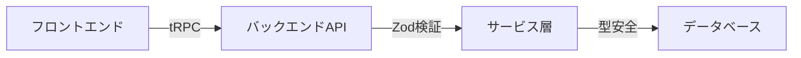
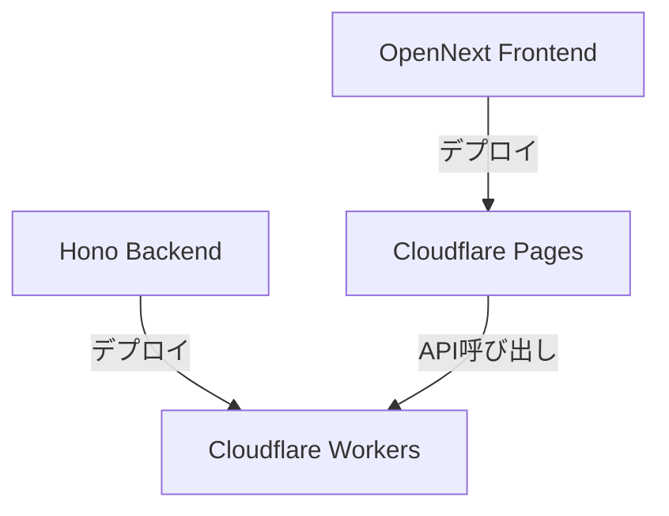

# シェアパースアプリケーションアーキテクチャ

## 1. システム概要

このアプリケーションは、モノレポ構成を採用し、型安全性を重視した現代的なクラウドネイティブアプリケーションです。

### 1.1 主要技術スタック

- **フロントエンド**: Next.js (OpenNext)
- **バックエンド**: Hono
- **デプロイ環境**: Cloudflare Workers
- **型安全性**: tRPC + Zod
- **パッケージ管理**: npm workspace

## 2. アーキテクチャ構成

### 2.1 モノレポ構造

```
.
├── packages/
│   └── shared/          # 共有型定義・スキーマ
├── frontend/           # Next.js フロントエンド
└── backend/           # Hono バックエンド
```

### 2.2 バックエンド設計（Hono + tRPC）

- **依存性注入（DI）パターンの採用**
  - コンポーネント間の疎結合を実現
  - テスト容易性の向上
  - 単一責任の原則に基づく実装

### 2.3 フロントエンド設計（Next.js + OpenNext）

- **機能ベースのディレクトリ構造**
  - `app/`: Routeグループによる機能分割
  - `components/`: 再利用可能なUIコンポーネント
  - `hooks/`: カスタムフック
  - `trpc/`: APIクライアント

### 2.4 共有パッケージ設計

- **型定義の一元管理**
  - Zodスキーマ
  - 共通型定義
  - APIインターフェース

## 3. データフロー



## 4. デプロイメント構成



## 5. 型安全性の確保

- tRPCによるエンドツーエンドの型安全性
- Zodによるランタイムバリデーション
- 共有パッケージによる型の一元管理

## 6. テスト戦略

### 6.1 バックエンド

- 結合テスト
  - APIエンドポイントの動作検証
  - エンドツーエンドの機能検証

### 6.2 フロントエンド

- Playwrightによるe2eテスト
  - ユーザーフローの検証
  - 実環境に近い統合テスト
