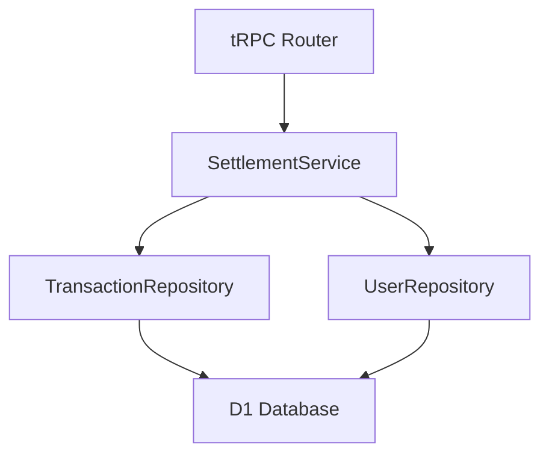

# 貸し借り状況取得API設計

## 1. 概要

2名のユーザー間における現在の貸し借り残高を取得するためのAPI設計書です。
ユーザー間の未精算取引を集計し、最終的な貸し借り状態を提供します。

## 2. コンポーネント構成

### 2.1 アーキテクチャ概要



### 2.2 インターフェース定義

```typescript
// Repository
interface ITransactionRepository {
  // 既存メソッド
  findById(id: number): Promise<TransactionResponse | undefined>;
  // 追加メソッド
  findUnSettledTransactions(userId: number, partnerId: number): Promise<UnSettledTransactionResponse[]>;
}

interface UnSettledTransactionResponse {
  id: number;
  payerId: number;
  amount: number;
  userShare: number;
  partnerShare: number;
  transactionDate: Date;
}

// Service
interface ISettlementService {
  getSettlementStatus(userId: number, partnerId: number): Promise<SettlementStatus>;
}

// tRPCルーター定義
getStatus: protectedProcedure
  .input(z.object({
    partnerId: z.string()
  }))
  .query(async ({ ctx, input }) => {
    const container = ctx.get('container');
    return await container.settlementService.getSettlementStatus(
      ctx.user.id,
      parseInt(input.partnerId)
    );
  })
```

### 2.3 レスポンス形式

```typescript
interface SettlementStatus {
  amount: number;  // プラス：受け取り、マイナス：支払い
}
```

#### レスポンス例

```json
{
  "amount": 3000  // 3,000円の受け取り
}
```

```json
{
  "amount": -2500  // 2,500円の支払い
}
```

## 3. 実装詳細

### 3.1 コンポーネントの実装

#### TransactionRepository

```typescript
export class TransactionRepository implements ITransactionRepository {
  constructor(private db: D1Database) {
    this.db = drizzle(db);
  }

  async findUnSettledTransactions(
    userId: number,
    partnerId: number
  ): Promise<UnSettledTransactionResponse[]> {
    return await this.db
      .select({
        id: transactions.id,
        payerId: transactions.payerId,
        amount: transactions.amount,
        transactionDate: transactions.transactionDate,
        userShare: sharedExpenses.shareAmount,
        partnerShare: this.db
          .select({ shareAmount: sharedExpenses.shareAmount })
          .from(sharedExpenses)
          .where(and(
            eq(sharedExpenses.transactionId, transactions.id),
            eq(sharedExpenses.userId, partnerId),
            eq(sharedExpenses.isSettled, false)
          ))
          .as('partner_share'),
      })
      .from(transactions)
      .innerJoin(
        sharedExpenses,
        and(
          eq(sharedExpenses.transactionId, transactions.id),
          eq(sharedExpenses.userId, userId),
          eq(sharedExpenses.isSettled, false)
        )
      )
      .where(
        transactions.payerId.in([userId, partnerId])
      )
      .orderBy(desc(transactions.transactionDate))
      .execute();
  }
}
```

#### BalanceService

```typescript
export class SettlementService implements ISettlementService {
  constructor(
    private transactionRepository: ITransactionRepository,
    private userRepository: IUserRepository
  ) {}

  async getSettlementStatus(userId: number, partnerId: number): Promise<SettlementStatus> {
    // ユーザーの存在確認
    const [user, partner] = await Promise.all([
      this.userRepository.findById(userId),
      this.userRepository.findById(partnerId)
    ]);

    if (!user || !partner) {
      throw new Error('User not found');
    }

    // 未精算取引の取得
    const transactions = await this.transactionRepository
      .findUnSettledTransactions(userId, partnerId);

    // 残高計算
    const balance = transactions.reduce((acc, tx) => {
      if (tx.payerId === userId) {
        // 自分が支払った場合：相手の負担額を加算
        return acc + tx.partnerShare;
      } else {
        // 相手が支払った場合：自分の負担額を減算
        return acc - tx.userShare;
      }
    }, 0);

    return { amount: balance };
  }
}
```

### 3.2 エラーハンドリング

1. バリデーションエラー
   - 不正なpartnerIdの形式
   - 数値変換エラー

2. ビジネスロジックエラー
   - ユーザーが存在しない
   - 自分自身をpartnerIdに指定

3. データベースエラー
   - クエリ実行エラー
   - トランザクションエラー

### 3.3 パフォーマンス最適化

1. インデックス設計

   ```sql
   CREATE INDEX idx_shared_expenses_user_settled 
   ON shared_expenses(user_id, is_settled);
   
   CREATE INDEX idx_transactions_payer 
   ON transactions(payer_id);
   ```

2. クエリ最適化
   - JOINの効率化
   - 必要なカラムのみ取得
   - サブクエリの最適化

## 4. テスト計画

### 4.1 単体テスト

1. TransactionRepository
   - findUnSettledTransactionsのテスト
   - エッジケースの確認

2. SettlementService
   - getSettlementStatusのテスト
   - 計算ロジックの検証

### 4.2 統合テスト

1. API エンドポイント
   - 正常系テスト
   - エラーケースのテスト
   - パフォーマンステスト

### 4.3 E2Eテスト

1. フロントエンドとの結合
   - データ表示の確認
   - エラーハンドリングの検証

## 5. セキュリティ考慮事項

1. 認証
   - protectedProcedureによる自動認証
   - トークンの検証

2. 認可
   - ユーザー間関係の確認
   - データアクセス権限の検証

3. 入力値検証
   - パラメータのサニタイズ
   - 型の厳密な検証
