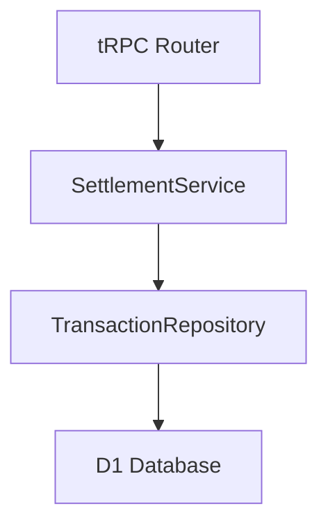

# 貸し借り状況取得API設計

## 1. 概要

2名のユーザー間における現在の貸し借り残高を取得するためのAPI設計書です。
未精算の支出から、各ユーザーの支払額と負担額を集計し、最終的な貸し借り状態を算出します。

## 2. コンポーネント構成

### 2.1 アーキテクチャ概要



### 2.2 データ取得ロジック

1. 未精算支出の抽出

```sql
SELECT 
  t.id,
  t.amount,
  t.payer_id,
  se.share_amount,
  se.user_id
FROM transactions t
JOIN shared_expenses se ON t.id = se.transaction_id
WHERE se.is_settled = 0
```

2. 残高計算ロジック

- 自分が支払った金額の合計
- 相手が支払った金額のうち、自分の負担分の合計
- 上記2つの差額が最終的な貸し借り状態

### 2.3 レスポンス形式

```typescript
interface SettlementStatus {
  amount: number;  // プラス：受け取り、マイナス：支払い
  details: {
    myPayments: number;      // 自分が支払った合計
    myShareOfPartner: number; // 相手の支払いの中での自分の負担分
  }
}
```

#### レスポンス例

```json
{
  "amount": 3000,
  "details": {
    "myPayments": 10000,
    "myShareOfPartner": 7000
  }
}
```

### 3. エラーハンドリング

1. データベースエラー
   - クエリ実行エラー
   - トランザクションエラー

2. 計算エラー
   - 数値変換エラー
   - オーバーフローチェック

### 4. パフォーマンス最適化

1. インデックス設計

```sql
CREATE INDEX idx_shared_expenses_settled 
ON shared_expenses(is_settled, transaction_id);

CREATE INDEX idx_transactions_date 
ON transactions(transaction_date);
```

2. クエリ最適化
   - 必要なカラムのみ取得
   - 適切なJOIN条件の設定

## 4. テスト計画

### 4.1 単体テスト

1. TransactionRepository
   - findUnSettledTransactionsのテスト
   - エッジケースの確認

2. SettlementService
   - getSettlementStatusのテスト
   - 計算ロジックの検証
