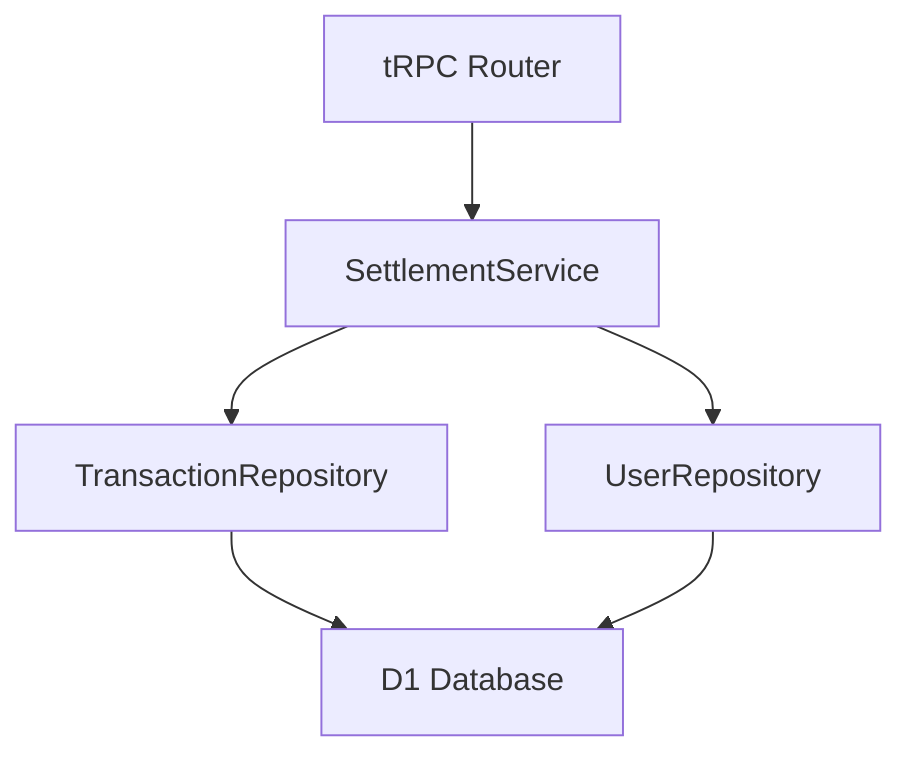

# 貸し借り状況取得API設計

## 1. 概要

2名のユーザー間における現在の貸し借り残高を取得するためのAPI設計書です。
ユーザー間の未精算取引を集計し、最終的な貸し借り状態を提供します。

## 2. コンポーネント構成

### 2.1 アーキテクチャ概要



### 2.3 レスポンス形式

```typescript
interface SettlementStatus {
  amount: number;  // プラス：受け取り、マイナス：支払い
}
```

#### レスポンス例

```json
{
  "amount": 3000  // 3,000円の受け取り
}
```

```json
{
  "amount": -2500  // 2,500円の支払い
}
```

### 3.2 エラーハンドリング

1. バリデーションエラー
   - 不正なpartnerIdの形式
   - 数値変換エラー

2. ビジネスロジックエラー
   - ユーザーが存在しない
   - 自分自身をpartnerIdに指定

3. データベースエラー
   - クエリ実行エラー
   - トランザクションエラー

### 3.3 パフォーマンス最適化

1. インデックス設計

   ```sql
   CREATE INDEX idx_shared_expenses_user_settled 
   ON shared_expenses(user_id, is_settled);
   
   CREATE INDEX idx_transactions_payer 
   ON transactions(payer_id);
   ```

2. クエリ最適化
   - JOINの効率化
   - 必要なカラムのみ取得
   - サブクエリの最適化

## 4. テスト計画

### 4.1 単体テスト

1. TransactionRepository
   - findUnSettledTransactionsのテスト
   - エッジケースの確認

2. SettlementService
   - getSettlementStatusのテスト
   - 計算ロジックの検証
